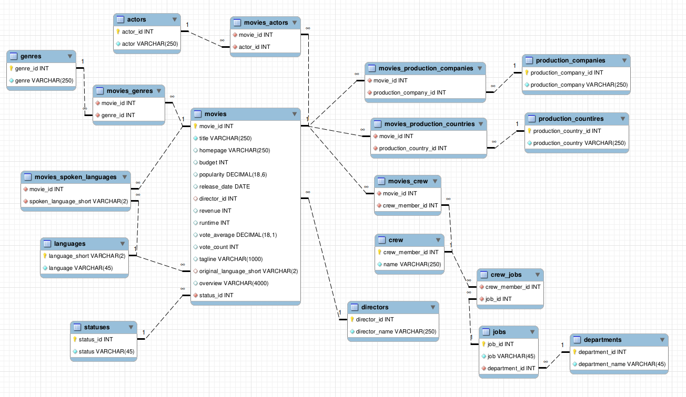

# DataBase Modelling

## Description
We have Excel files containing the information about popular movies and actors.
The problem is that some of the columns contain JSON data or several values in the same row, there are also some encoding errors.
  The goal of this project is to define a database schema allowing to work comfortably with the data.
The database relationship diagram is at the picture below.

## Steps
1. Initialize and launch MySQL database in docker container.
2. Transform data using Python.
3. Load data into database using Prefect orchestrator.
4. Write bash script to access database.

## Data source
movies dataset - https://www.kaggle.com/datasets/utkarshx27/movies-dataset
  actors dataset - https://www.kaggle.com/datasets/darinhawley/imdb-films-by-actor-for-10k-actors

## Instructions
1. Run `docker-compose up -d` command to start MySQL database in docker.
2. Run `data_ingestion.py` to perform all necessary transformations and load the data into database.
3. Launch `run_sql.sh` to start writing SQL queries.
